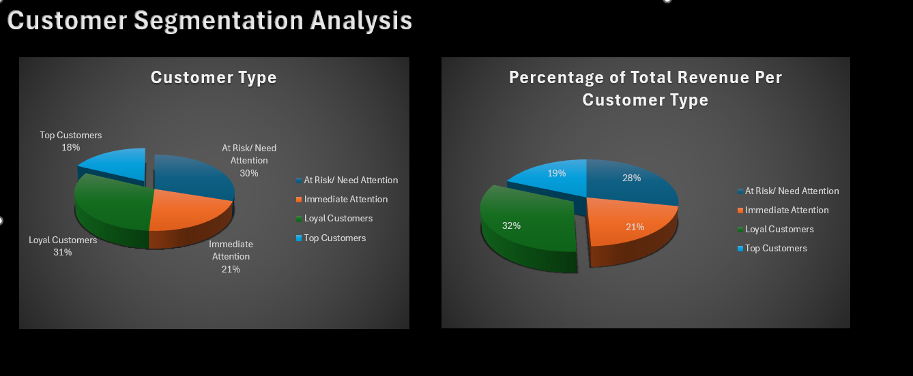

# 🧩 Customer Segmentation Project (Excel Dashboard)

## 📌 Project Overview

This project analyzes customer purchasing behavior using Excel to segment customers into meaningful groups. The goal is to provide actionable insights that can improve marketing strategies, customer retention, and business performance.

---

## 🎯 Objectives

- Understand customer behavior using RFM (Recency, Frequency, Monetary) analysis
- Segment customers into four categories: top customers, loyal customers, immediate attention, at-risk/need attention
- Find total revenue generated by each customer segment
- Visualize revenue percentage and segment distributions using interactive Excel dashboards

---

## 📊 Tools & Techniques Used

- Microsoft Excel  
- Pivot Tables & Pivot Charts  
- Conditional Formatting  
- Slicers and Filters  
- Data Cleaning & Transformation  
- RFM Analysis

---

## 🔍 Key Insights

- **Top 18% of customers** contribute to **19% of total revenue**
- **Loyal customers** contribute to **the highest percentage (32%) of total revenue**
- Most high-value customers are repeat buyers with recent purchases
- Opportunities exist to **re-engage inactive customers** and upsell to mid-tier segments

---

## 🖼️ Dashboard Preview

---

## 📂 Files Included

| File Name               | Description                             |
|------------------------|-----------------------------------------|
| `customer_data.xlsx`   | Excel workbook with analysis & dashboard |
| `dashboard-preview.PNG`| Dashboard screenshot                     |

---

## 🔗 View or Download Excel File

📥 [Click here to view/download the Excel file](https://docs.google.com/spreadsheets/d/10AKKe8sV8IbS7mZkHmsi3MKgZ4mfqyir/edit?usp=sharing&ouid=115277383657838265435&rtpof=true&sd=true)

*Note: Due to GitHub's file size limit, the Excel file is hosted externally.*

---

## 📈 Future Improvements

- Build the same dashboard in Power BI for comparison  
- Add clustering (K-Means) using Python for more granular segmentation  
- Automate report generation using VBA or Python scripts
